<div align="center">
  
  <p>
    Writing a raytracer in C.
  </p>
</div>
  

# About the project
A project made in accordance with the MiniRT project which is part of the Codam Core Curriculum. For this project it was mandatory to use [the school's graphics library](https://github.com/codam-coding-college/MLX42). The purpose of the project is to write a raytracer. A ray tracer is a type of graphics rendering technique that simulates the physical behavior of light to generate images. It traces the path of light rays from the eye of the observer back to the light source, calculating the color of each pixel based on the material it hits and the angle of incidence.

# Features
Check the [subject](https://github.com/fkoolhoven/miniRT/blob/main/subject.pdf) for all the requirements we had to meet.

<br>
Simple geometric objects with adjustable position, rotation, size and color
<div style="display: flex; justify-content: space-between;">
  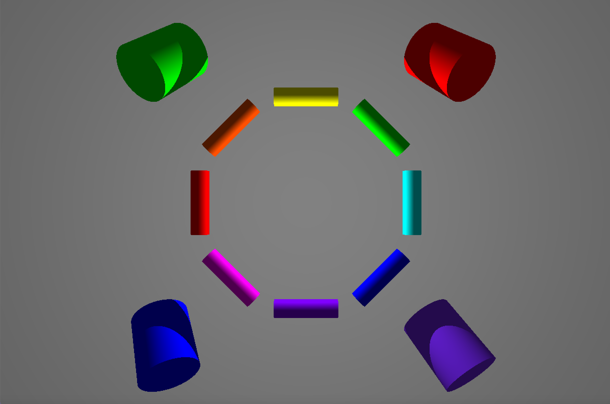
  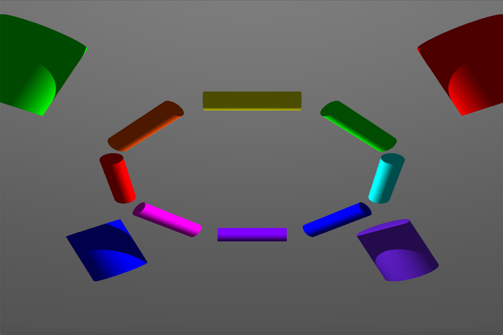
  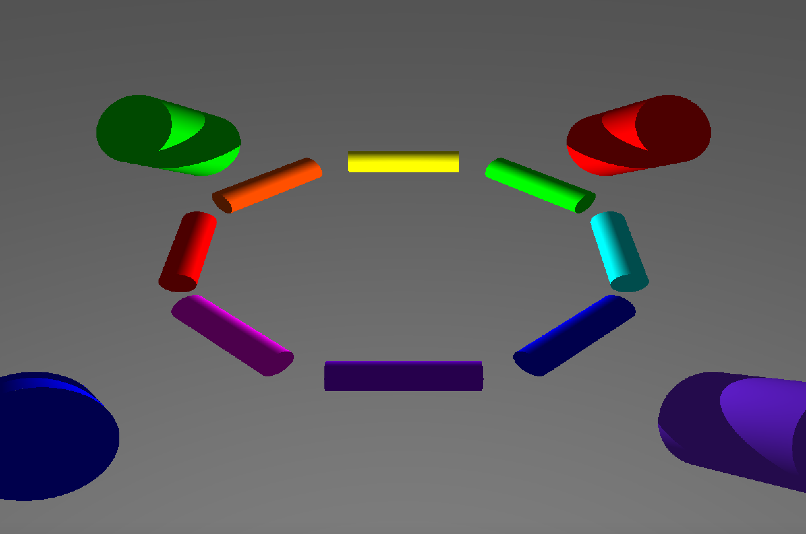
</div>
Diffuse and ambient light, with adjustable color, intensity and position <br>
Planes, cylinders, spheres
<div style="display: flex; justify-content: space-between;">
  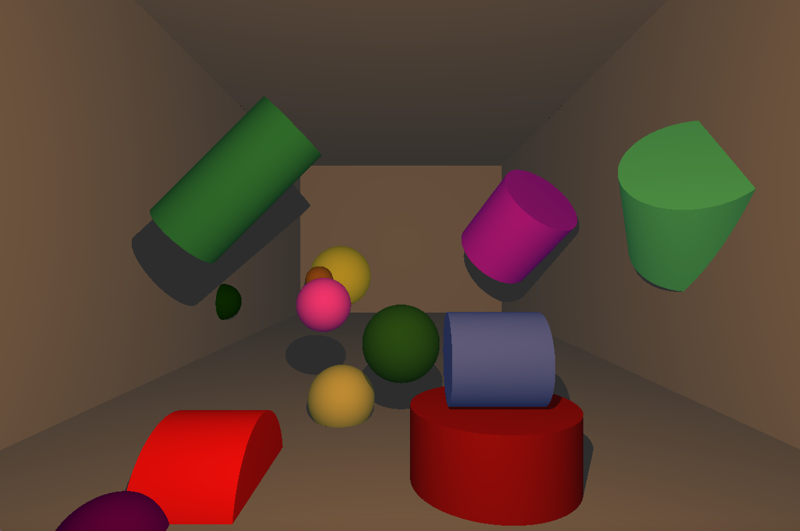
  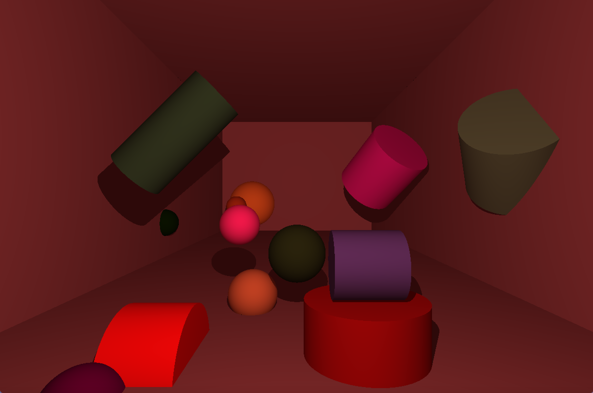
  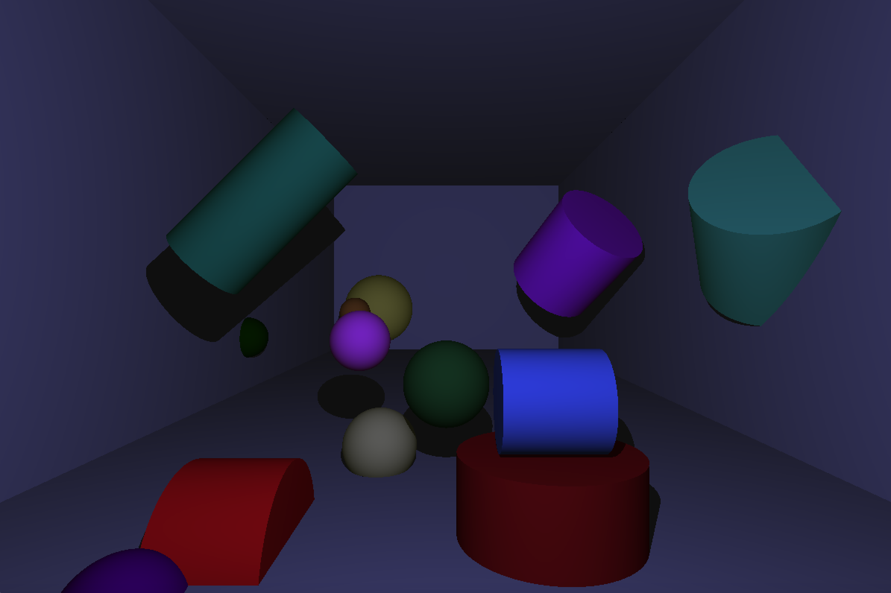
</div>
Objects intersecting, adjustable camera (position, orientation, field of view)
<div style="display: flex; justify-content: space-between;">
  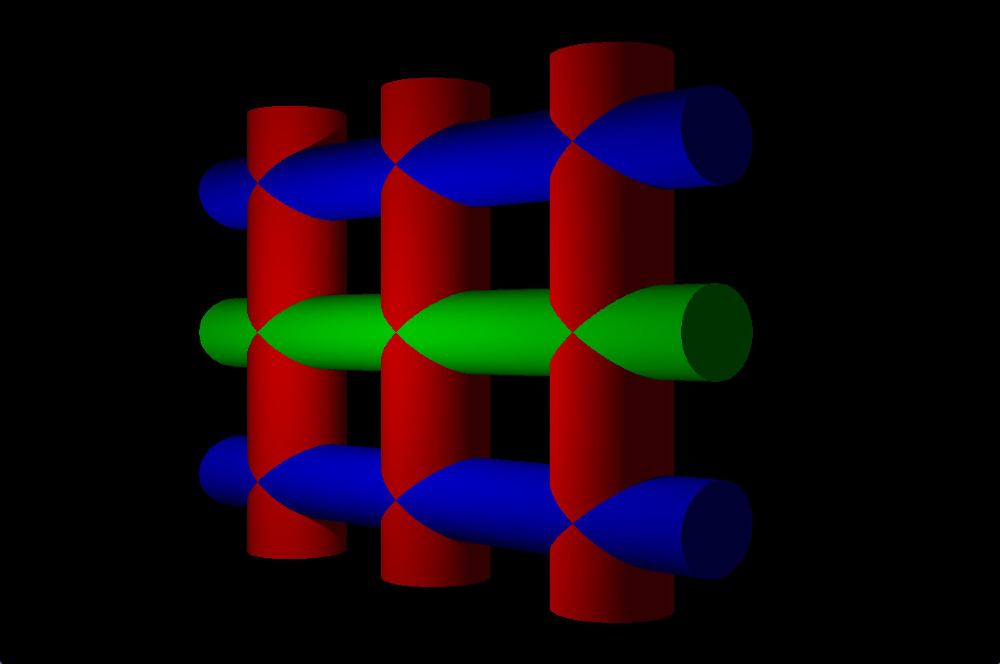
  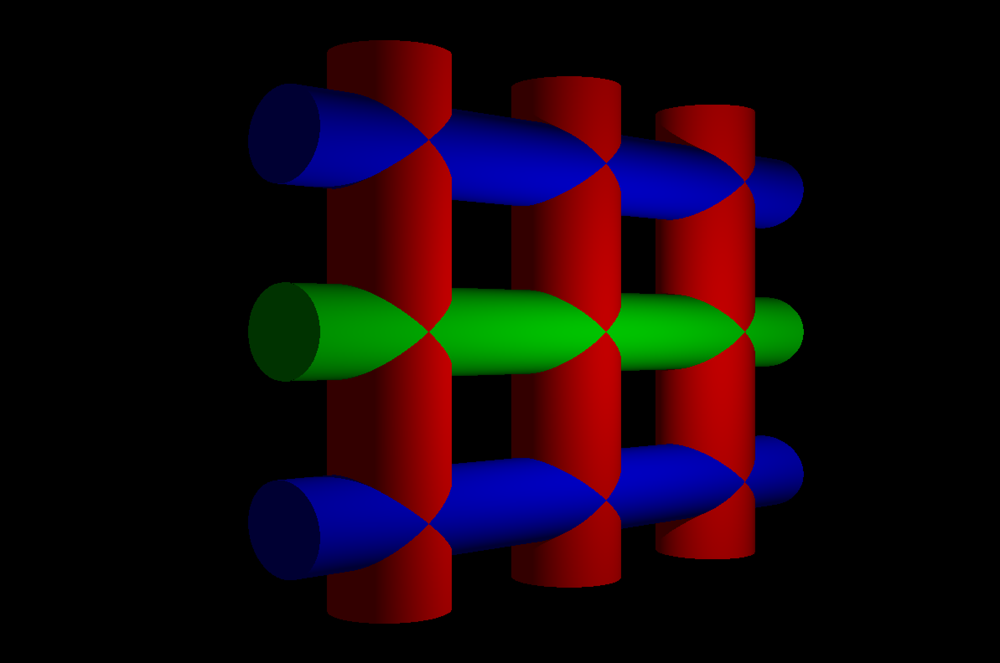
  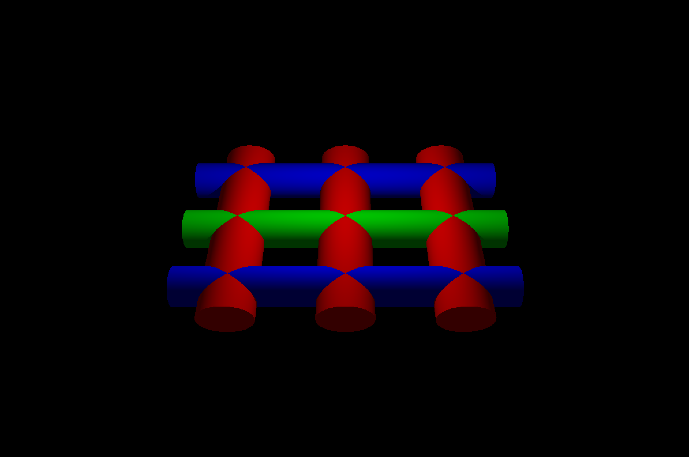
</div>
Different points of view, shadows
<div style="display: flex; justify-content: space-between;">
  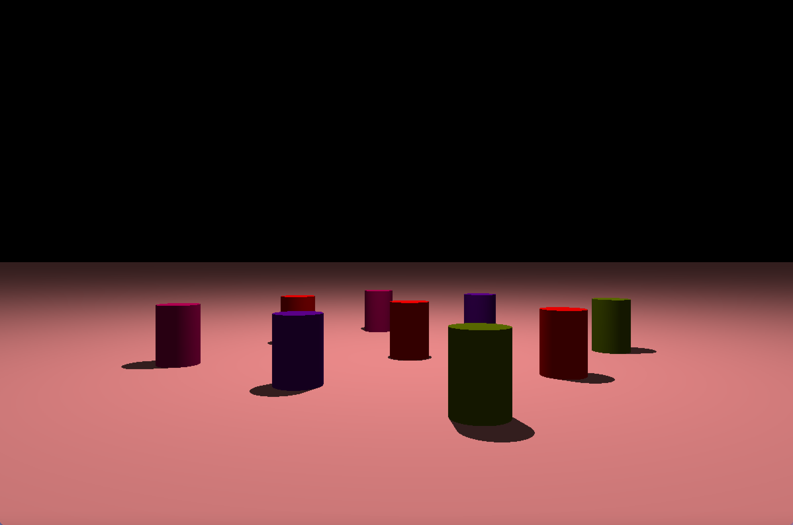
  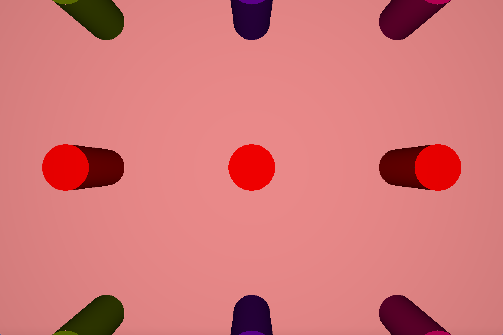
  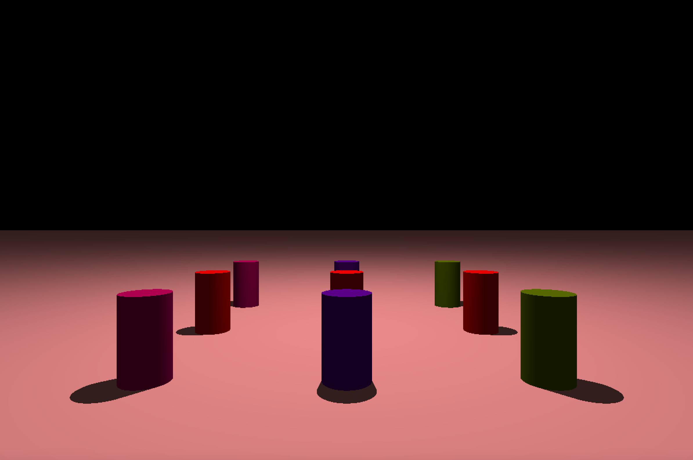
</div>
Spheres, adjustable light, shadows
<div style="display: flex; justify-content: space-between;">
  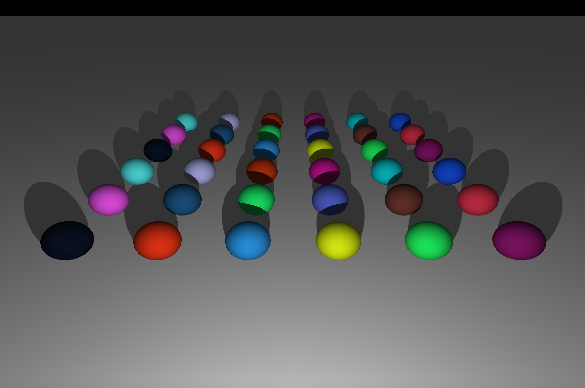
  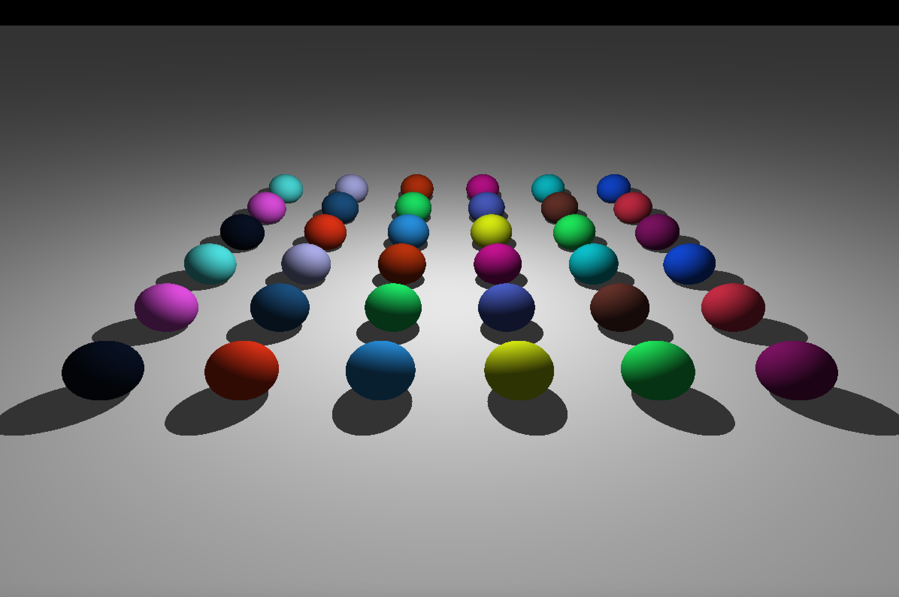
  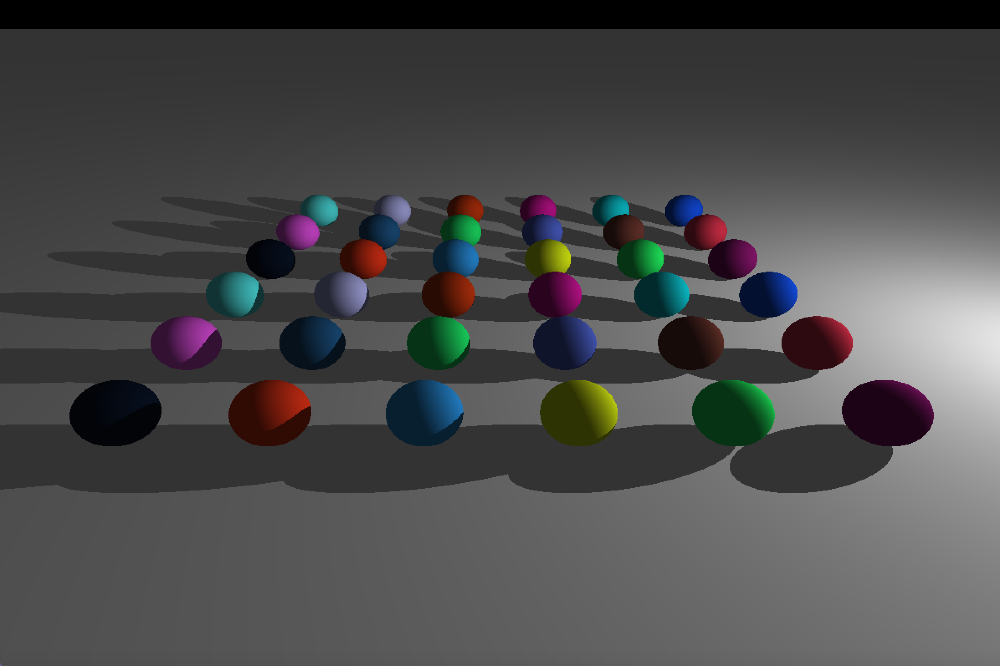
</div>

# Getting started

Start by cloning the repository:
```c
git clone --recursive https://github.com/fkoolhoven/miniRT.git
```

Compile by using make:
```c
make
``` 

# Usage
⚠️ Please note this project was made on/for Linux! ⚠️

MiniRT takes a .rt file as input. The file describes a world/scene. For example:
```c
./miniRT scenes/sphere.rt
```
describes a world with a single sphere, a camera looking at it and a light source illuminating it.

- Use left and right arrow to change the camera position across the X-axis
- Use up and down arrow to change the camera position across the Y-axis
- Use P and L arrow to change the camera position across the Z-axis
- Use A and D to change the change the camera orientation across the X-axis
- Use W and S to change the change the camera orientation across the Y-axis
- Use R and F to change the change the camera orientation across the Z-axis
- Use { and } to change the change the camera field of view

# Important learnings
- Graphics programming
- Introduction to raytracing
- Implementing mathematical formulas in C
- Debugging complex mathematics
- Using an external graphics library

# Contact
See my profile page for ways to contact me!
